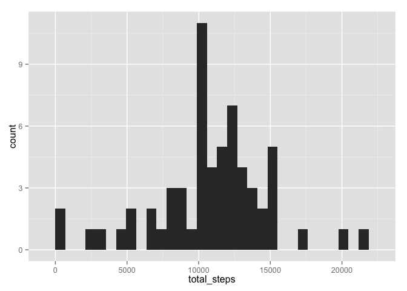

# Reproducible Research: Peer Assessment 1


## Loading and preprocessing the data


```r
activity_df <- read.csv(unz("activity.zip","activity.csv"))
activity_df$date <- as.Date(activity_df$date)
```

## What is mean total number of steps taken per day?

```r
library(dplyr)
```

```
## 
## Attaching package: 'dplyr'
## 
## The following objects are masked from 'package:stats':
## 
##     filter, lag
## 
## The following objects are masked from 'package:base':
## 
##     intersect, setdiff, setequal, union
```

```r
library(ggplot2)

daily_totals <- activity_df %>%
                  group_by(date) %>%
                  summarise(total_steps = sum(steps))

ggplot(daily_totals, aes(x = total_steps)) +
      geom_histogram()
```

```
## stat_bin: binwidth defaulted to range/30. Use 'binwidth = x' to adjust this.
```

 

```r
mean_steps <- mean(daily_totals$total_steps, na.rm = TRUE)
median_steps <- median(daily_totals$total_steps, na.rm = TRUE)
```
The **mean** number of steps per day is: 1.0766 &times; 10<sup>4</sup>

The **median** number of steps per day is: 10765

## What is the average daily activity pattern?

```r
interval_mean <- activity_df %>%
                  group_by(interval) %>%
                  summarise(mean_steps = mean(steps, na.rm = TRUE))
ggplot(interval_mean, aes(x = interval, y = mean_steps)) +
      geom_line()
```

 

```r
max_interval <- interval_mean$interval[which.max(interval_mean$mean_steps)]
max_steps <- max(interval_mean$mean_steps)
```
On average the 835 interval contains the **max** steps
of 206.1698 steps.

## Imputing missing values

```r
summary(activity_df)
```

```
##      steps            date               interval   
##  Min.   :  0.0   Min.   :2012-10-01   Min.   :   0  
##  1st Qu.:  0.0   1st Qu.:2012-10-16   1st Qu.: 589  
##  Median :  0.0   Median :2012-10-31   Median :1178  
##  Mean   : 37.4   Mean   :2012-10-31   Mean   :1178  
##  3rd Qu.: 12.0   3rd Qu.:2012-11-15   3rd Qu.:1766  
##  Max.   :806.0   Max.   :2012-11-30   Max.   :2355  
##  NA's   :2304
```

```r
num_nas <- sum(is.na(activity_df$steps))
```
There are a total of 2304 NA's in the dataset.

Use the average number of steps from each time interval to fill in NA's

```r
na_inicies <- which(is.na(activity_df$steps))
na_steps_df <- activity_df[na_inicies,]
impute_vals <- left_join(x = na_steps_df, y = interval_mean)
```

```
## Joining by: "interval"
```

```r
steps_no_na <- activity_df$steps
steps_no_na[na_inicies] <- impute_vals$mean_steps
activity_df_clean <- activity_df
activity_df_clean$steps <- steps_no_na

summary(activity_df_clean)
```

```
##      steps            date               interval   
##  Min.   :  0.0   Min.   :2012-10-01   Min.   :   0  
##  1st Qu.:  0.0   1st Qu.:2012-10-16   1st Qu.: 589  
##  Median :  0.0   Median :2012-10-31   Median :1178  
##  Mean   : 37.4   Mean   :2012-10-31   Mean   :1178  
##  3rd Qu.: 27.0   3rd Qu.:2012-11-15   3rd Qu.:1766  
##  Max.   :806.0   Max.   :2012-11-30   Max.   :2355
```


```r
daily_totals_clean <- activity_df_clean %>%
                          group_by(date) %>%
                          summarise(total_steps = sum(steps))

ggplot(daily_totals_clean, aes(x = total_steps)) +
      geom_histogram()
```

```
## stat_bin: binwidth defaulted to range/30. Use 'binwidth = x' to adjust this.
```

 

```r
mean_steps_clean <- mean(daily_totals_clean$total_steps)
median_steps_clean <- median(daily_totals_clean$total_steps)
```
The **new mean** number of steps per day is: 1.0766 &times; 10<sup>4</sup>

The **new median** number of steps per day is: 1.0766 &times; 10<sup>4</sup>

## Are there differences in activity patterns between weekdays and weekends?


```r
activity_df_clean$weekday <- weekdays(activity_df_clean$date)
activity_df_clean$day_category <- ifelse(activity_df_clean$weekday %in% c("Saturday","Sunday"),"Weekend", "Weekday")

weekday_interval <- activity_df_clean %>%
                        group_by(interval, day_category) %>%
                        summarise(mean_steps = mean(steps))

ggplot(weekday_interval, aes(x = interval, y = mean_steps)) +
      geom_line() +
      facet_grid(day_category~.)
```

 


